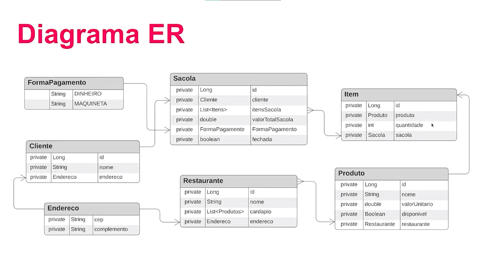

# 🛒 Sacola API - iFood dev week
> Sacola API para Servir uma Aplicação com Domínio de Delivery

## ✔️ Status do Projeto
> 🚧 Em construção...  🚧

## 🧾 Modelo do Projeto - ER

## 🛠️ Tecnologias Utilizadas

- spring initialzr
- spring-boot-starter-web
- spring-boot-starter-data-jpa
- lombok
- springfox-boot-starter
- h2